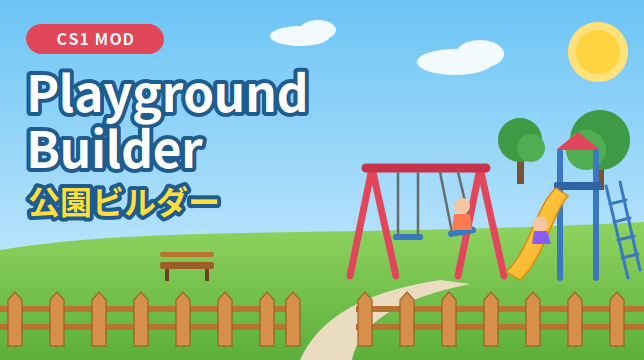
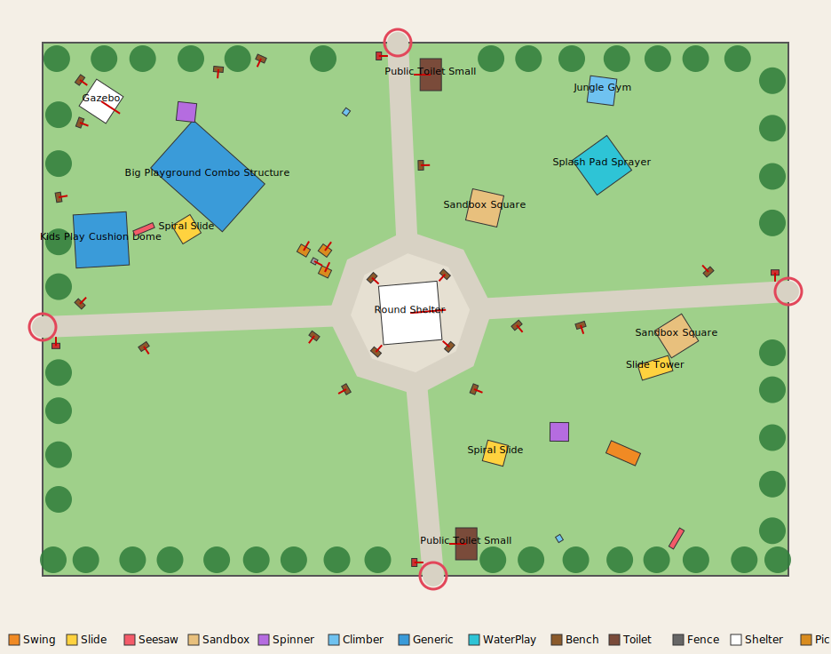

<p align="center"></p>

# Playground Builder

**A Cities: Skylines (CS1) mod that builds a complete park from a dragged area, and lets residents actually use it.**

[English](#english) | [日本語](#日本語)

---

## English

### Features
- **Park plan layout**: a central plaza with a shelter, paths from the entrances, and zones for active play, toddlers, water/sand and open lawn.
- **Different every time**: each build (and each `R` rebuild) picks a new set of props and new entrance positions.
- **Amenities**: toilets and signs at the entrances, picnic tables and a drinking fountain by the plaza, benches along paths and edges.
- **Edge**: a tree ring and a fence (fence networks preferred, props as fallback). The fence and paths follow the terrain.
- **Residents play**: nearby residents (mostly children) walk in along the paths.
  - Swings: a real pendulum.
  - Seesaws: go up and down with a partner.
  - Slides: climb the ladder and slide down.
  - Benches: sit down.
  - Toilets and drinking fountains: visited during a stay.
- **Protected area**: houses and other growables can't be built in a park, and zoning inside is removed.
- **English / Japanese** UI, switchable instantly in the options.

<p align="center"></p>

### Requirements
- [Harmony 2](https://steamcommunity.com/sharedfiles/filedetails/?id=2040656402) (Workshop)
- **Playground props from the Workshop.** The base game has almost no playground equipment. The mod finds props by name among loaded assets, so subscribe to:
  - playground equipment (swings, slides, seesaws, sandboxes, climbing frames, play structures): required
  - benches, toilets, shelters/pergolas, picnic tables, drinking fountains, park signs: recommended
  - a fence network or fence props: recommended
- Japanese text needs a Japanese font mod.

### Usage
| Input | Action |
|---|---|
| "Park" button (top left) / `Ctrl+P` | Open / close the tool |
| Drag | Build in a rectangle |
| Click points, then click the first point or right-click | Build in a polygon |
| `R` over a park | Rebuild with a new set |
| `Delete` over a park | Remove the park |
| `Esc` | Cancel input / close the tool |

Found assets are listed in `output_log.txt` (`[PlaygroundMod] found: ...`). Assets that aren't recognized by name can be added with keywords in `%LOCALAPPDATA%\Colossal Order\Cities_Skylines\PlaygroundMod.xml`.

### Building from source
Requirements: .NET SDK (any recent version) and a local CS1 install.

```sh
dotnet build -c Release -p:CitiesPath="C:\Program Files (x86)\Steam\steamapps\common\Cities_Skylines"
```

- `CitiesPath` can also come from the `CITIES_SKYLINES_PATH` environment variable.
- The build copies `PlaygroundMod.dll`, `CitiesHarmony.API.dll` and `PreviewImage.png` to `%LOCALAPPDATA%\Colossal Order\Cities_Skylines\Addons\Mods\PlaygroundMod`.
- Game assemblies are referenced from your install and are not part of this repository.

### Project layout
| Path | Contents |
|---|---|
| `Source/Mod.cs` | Mod entry, options UI (live language switching), loading |
| `Source/LayoutGenerator.cs` | Park plan: plaza, entrances, paths, zones, trees |
| `Source/PlacementGenerator.cs` | Random layout, fence props, placement checks |
| `Source/PropCatalog.cs` | Finds and classifies props, trees and networks; reads play equipment shape from meshes |
| `Source/ActorManager.cs` | Spawns visitors, paths, playing / resting / errands |
| `Source/NetBuilder.cs`, `Source/FenceBuilder.cs` | Path and fence networks (terrain following) |
| `Source/ParkGuard.cs` | Blocks buildings and removes zoning inside parks |
| `Source/Patches.cs` | Harmony patches |
| `Source/ZoneManager.cs` | Park data, create / remove, save data |
| `Workshop/` | Preview image and Workshop description |
| `docs/DESIGN.ja.md` | Detailed design notes (Japanese) |

### License
[MIT](LICENSE). Cities: Skylines is a trademark of Paradox Interactive. This project is not affiliated with Paradox Interactive or Colossal Order.

---

## 日本語

### 機能
- **公園レイアウト**: 中央の広場とシェルター、入口からの園路を作り、アクティブ／幼児用／水遊び・砂場／芝生のゾーンに分けて配置します。
- **毎回違う公園**: 設置のたびに（`R` で作り直すたびに）、遊具の組み合わせと入口の位置が変わります。
- **設備**: 入口にトイレと案内板、広場の近くにピクニックテーブルと水飲み場、園路や外周にベンチを置きます。
- **外周**: 植木と柵を置きます（柵はネットワーク優先、無ければProp）。柵と園路は地形に沿って敷きます。
- **住民が遊ぶ**: 近所の住民（おもに子ども）が園路を歩いてやって来ます。
  - ブランコ: 振り子のように揺れる
  - シーソー: 2人そろうと交互に上下する
  - 滑り台: はしごを登って滑り降りる
  - ベンチ: 座って休む
  - トイレと水飲み場: 滞在中に立ち寄る
- **敷地の保護**: 公園内には住宅などの建物が建たず、ゾーンも消えます。
- **日本語／英語**: オプション画面ですぐに切り替えられます。

### 必要なもの
- [Harmony 2](https://steamcommunity.com/sharedfiles/filedetails/?id=2040656402)（ワークショップ）
- **ワークショップの遊具Prop。** バニラには遊具がほとんど無いので、先に購読してください。読み込まれているPropを名前で探して使います。
  - 遊具（ブランコ、滑り台、シーソー、砂場、ジャングルジム、複合遊具など）: 必須
  - ベンチ、トイレ、東屋・パーゴラ、ピクニックテーブル、水飲み、案内板: 推奨
  - 柵のネットワークまたは柵のProp: 推奨
- 日本語の表示には日本語フォントのMODが必要です。

### 操作方法
| 操作 | 内容 |
|---|---|
| 画面左上の「公園」ボタン / `Ctrl+P` | ツールを開く・閉じる |
| ドラッグ | 四角形の範囲で作成 |
| クリックで頂点を追加し、始点クリックか右クリックで確定 | 多角形の範囲で作成 |
| 公園の上で `R` | 別の組み合わせで作り直す |
| 公園の上で `Delete` | 公園を削除 |
| `Esc` | 入力の取り消し・ツールの終了 |

見つかったアセットは `output_log.txt` に `[PlaygroundMod] found: ...` として出ます。名前で判定できないアセットは、`%LOCALAPPDATA%\Colossal Order\Cities_Skylines\PlaygroundMod.xml` にキーワードを追加すれば使えます。

### ソースからのビルド
必要なもの: .NET SDK（最近のもの）と、CS1 本体のインストール。

```sh
dotnet build -c Release -p:CitiesPath="C:\Program Files (x86)\Steam\steamapps\common\Cities_Skylines"
```

- `CitiesPath` は環境変数 `CITIES_SKYLINES_PATH` でも指定できます。
- ビルドすると、`PlaygroundMod.dll`・`CitiesHarmony.API.dll`・`PreviewImage.png` が `%LOCALAPPDATA%\Colossal Order\Cities_Skylines\Addons\Mods\PlaygroundMod` にコピーされます。
- ゲーム本体のDLLは、手元のインストールを参照するだけです。このリポジトリには含みません。

詳しい設計メモは [docs/DESIGN.ja.md](docs/DESIGN.ja.md) にあります。

### ライセンス
[MIT](LICENSE)。Cities: Skylines は Paradox Interactive の商標です。本プロジェクトは Paradox Interactive および Colossal Order とは関係ありません。
